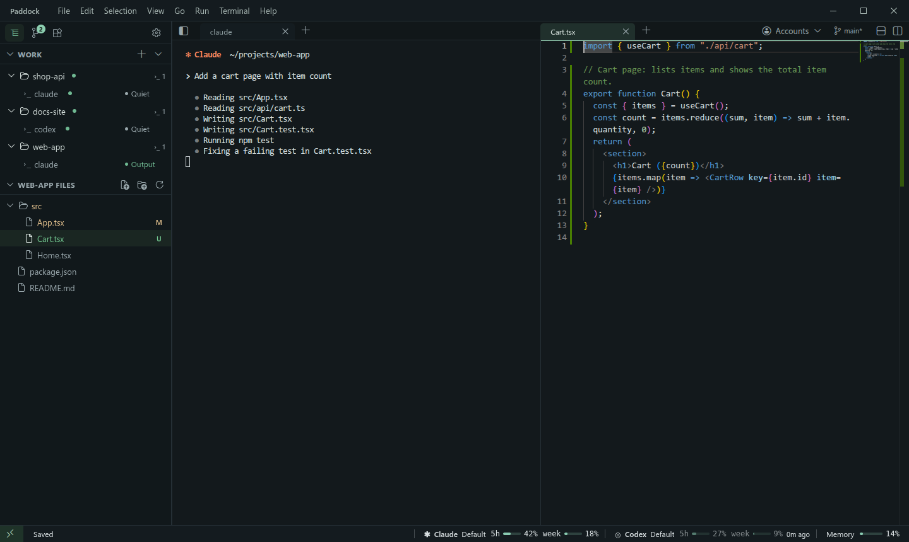
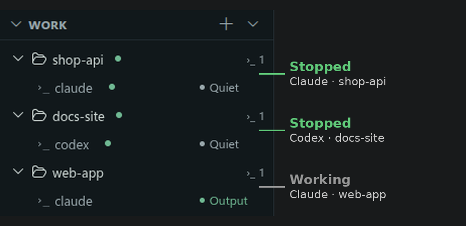
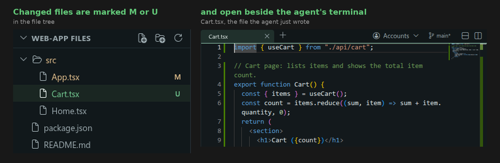
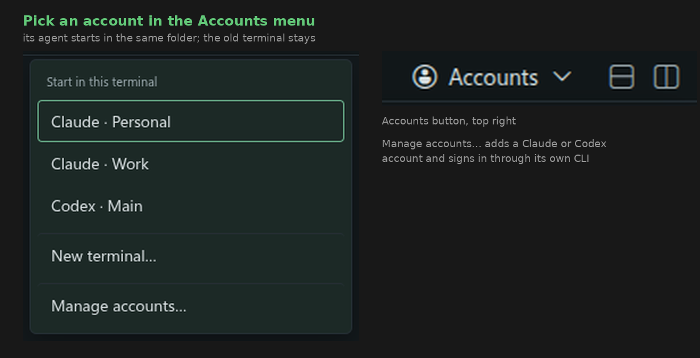
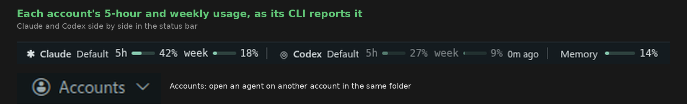

# Paddock

**Every repo's Claude Code and Codex agents in one window, with a sound the moment one stops.**

Run agents in several repos and you only learn one has finished when you tab through terminals to find it, and it sat idle until then. Paddock is a terminal app that lists every repo's agents in one window and tells you.

**[Download for macOS or Windows](#install)** · Free app, MIT license

*Screenshots show example projects and sample usage numbers.*

## Why Paddock

### Every agent in one list, with a sound when one stops

When an agent you aren't watching stops, **a sound plays and a green dot marks its repo and terminal**. Run `claude` or `codex` in a Paddock terminal as usual and its repo joins the sidebar. ([How a stop is detected](docs/settings.md#stop-alerts): the output goes quiet, so a silent build counts too.)

### Open the files they changed

Changed files are **marked M or U in the file tree and open beside the terminal**, so you check the work and type the next instruction without leaving the window.

### Several accounts in one place

Keep several Claude and Codex accounts, each signed in through its own CLI. **Each account's 5-hour and weekly usage** shows in the status bar once an agent on it has replied, as its CLI reports it; when one runs low, **pick another account in the Accounts menu** and its agent starts in the same folder.

No project setup: your logins and skills stay as they are.

**vs. other tools:** no worktrees to manage, Claude Code and Codex side by side, macOS and Windows alike.

**vs. tmux:** Paddock alerts without scripts or key bindings; tmux keeps agents running after you close it, Paddock's stop when you quit (resume with `claude --resume` or `codex resume`).

**Private:** Paddock collects nothing: no telemetry, no account, no server of its own, so your code and conversations are never used to train an AI. Its only outside connections are [Open VSX](https://open-vsx.org), to look up extensions, and Google, to download a spell-check dictionary; neither is sent your code, terminals or conversations. It never stores or sends your credentials; to tell accounts apart it only reads the account id from each CLI's own login file. Agents are the official CLIs, signed in by you; what they send follows Claude's or Codex's own terms.

## Install

| System | File |
| --- | --- |
| macOS (Apple Silicon) | [Paddock-mac-arm64.dmg](https://github.com/YoungJaeChoung/paddock/releases/latest/download/Paddock-mac-arm64.dmg) |
| macOS (Intel) | [Paddock-mac-x64.dmg](https://github.com/YoungJaeChoung/paddock/releases/latest/download/Paddock-mac-x64.dmg) |
| Windows, including WSL | [Paddock-win-x64.exe](https://github.com/YoungJaeChoung/paddock/releases/latest/download/Paddock-win-x64.exe) |

Linux: no installer yet; [build from source](docs/building.md).

The installers are built by the public [Package workflow](https://github.com/YoungJaeChoung/paddock/actions/workflows/package.yml) but aren't code-signed yet, so your system warns on first run:

- **macOS 15 or later:** open the app once, then choose **Open Anyway** in System Settings → Privacy & Security. Earlier macOS: Control-click the app and choose **Open**.
- **Windows:** in SmartScreen, choose **More info → Run anyway**.

[Settings and details](docs/settings.md) · [Build from source](docs/building.md) · [MIT License](LICENSE)
