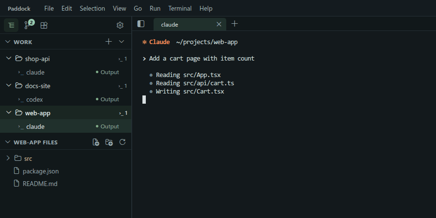

# Paddock settings and details

Open settings with `Ctrl+,` (macOS `Cmd+,`) and search for `paddock`.

- **Agent permission prompts** (`paddock.agents.permissions`): how Claude and Codex started from **Accounts** handle permission prompts. `ask` (default) asks before each tool use. `allowSkip` lets Claude switch to skipping prompts inside the session with Shift+Tab. `skip` starts Claude with `--dangerously-skip-permissions` and Codex with `--dangerously-bypass-approvals-and-sandbox`, so agents change files and run commands without asking — use it only in folders you can restore. Agents you start by typing `claude` or `codex` follow their own settings.
- **Done sound** (`paddock.agentDoneSound`): turn the stop sound off.

## Accounts and usage

Keep several Claude and Codex accounts, each signed in through its own CLI. After an account's first reply, its 5-hour and weekly usage shows in the status bar. The numbers are what each CLI reports — Claude Code through its status line, Codex through its own limit query — not read from your login. A new account starts a new conversation; go back to the old one with `claude --resume` or `codex resume` in its own terminal.

## Stop alerts

An agent you aren't watching is marked when it has printed for at least 5 seconds and then goes quiet for 3: a short sound plays and a green dot marks its repo and terminal. Open it and the dot clears. Paddock watches the terminal's output, so the dot means "stopped": read the last lines to see whether it finished or is waiting for your answer. A long build step that prints nothing also counts as a stop.

## Layout

Quit and reopen: repos, terminals, tab order and splits return. Closing a terminal asks first. Agents stop when you quit Paddock.
